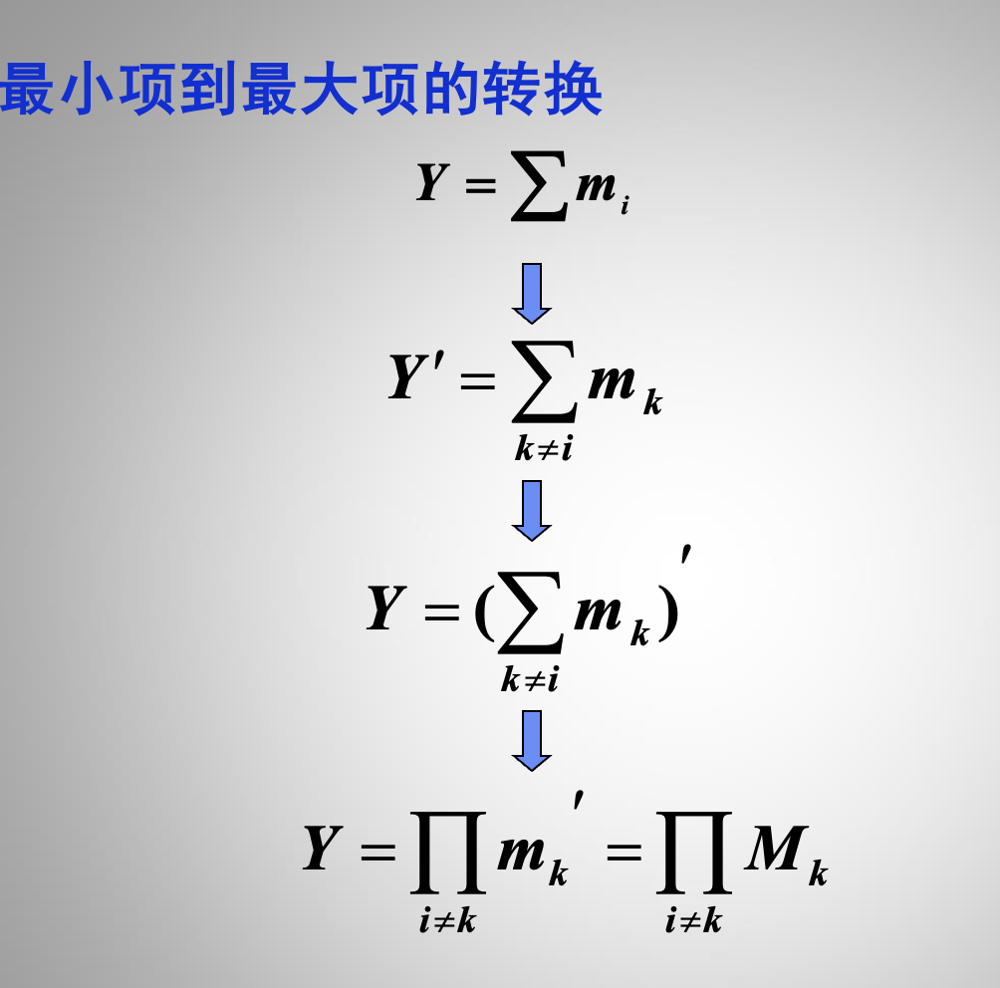

对于第一张图片的2)

$Y = \overline{A\bar{B}\bar{C} + \bar{A}B + ....}$
对于这样的一个Y
我们可以很简单地使用卡诺图求出$\bar{Y}$

而$Y$和$\bar{Y}$的真值表完全相反
因此我们只需要在卡诺图阶段，用0代替1，用1代替0即可

对于第二张图片的1）

*卡诺图就是特殊的真值表*

约束条件的意思就是环境的条件，环境不可能让ABCD的输入不满足该等式
因此ABC = 1 ......的输出可以是X

针对最大最小项，有该公式
这是最大最小项的编码所规定的