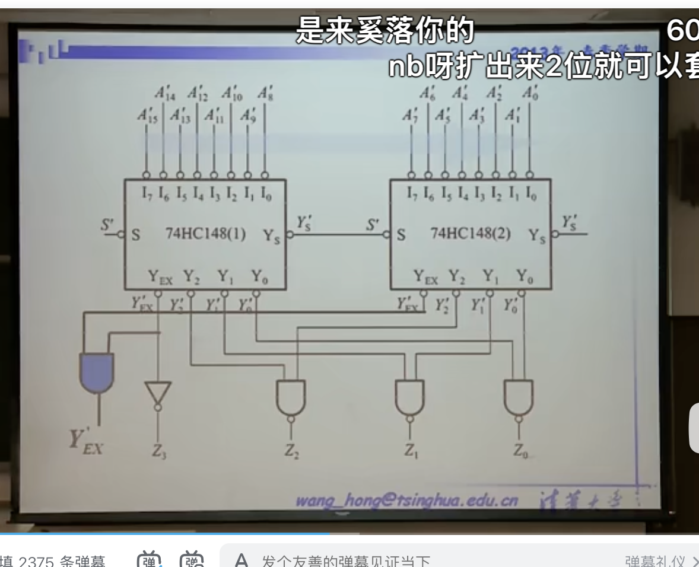

对于使能端：
s'为低且没有编码输入时，Ys‘为低，导致第二个s‘为低，工作
因此这是一个优先片选，同时只有一个芯片工作
(Ys' 为s开启，且没有编码输入)

对于从8位到16位
实际上编码从3位到4位
多出来的那一位实际上完全等效于哪个芯片工作的信号

因此可以将Y'ex输出
而与非门：提供了低电平有效时的，“或”逻辑
保证有效的低电平直接通过，若Y'2其中一个为低
那么输出就为1

输出的z是高有效的